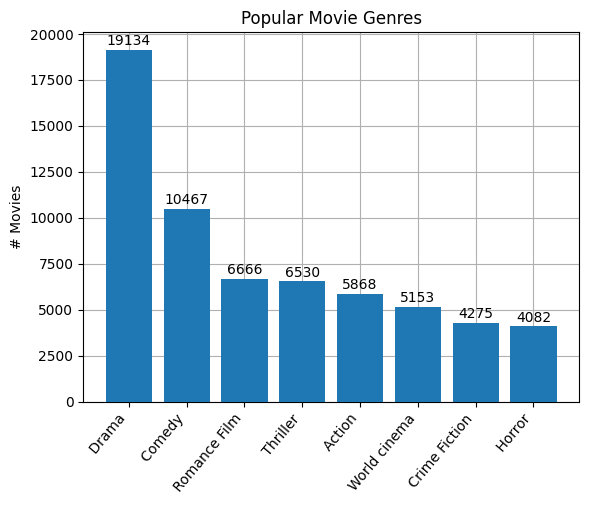
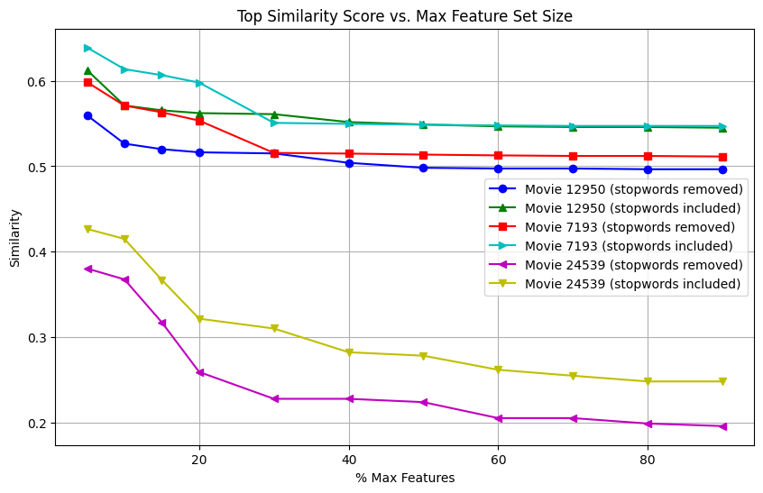
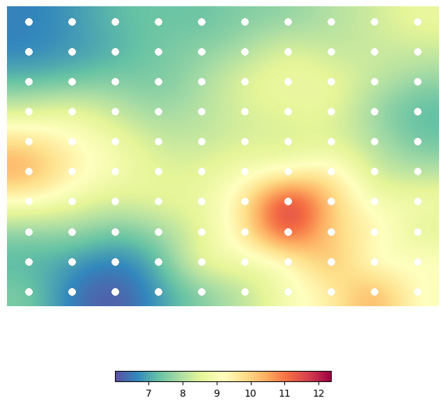
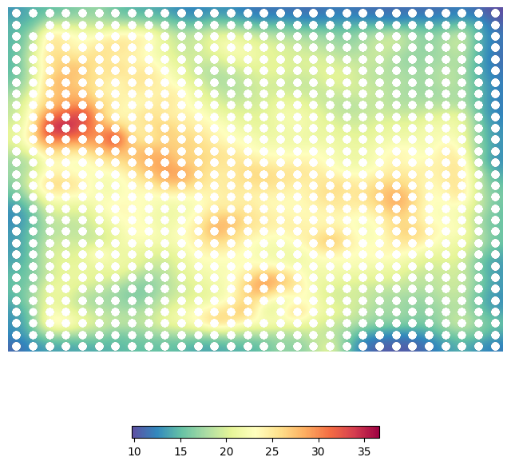
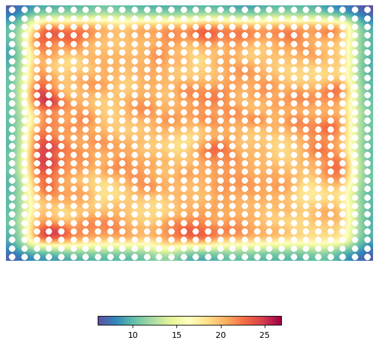

# Movie Recommendation System using Self-organizing Maps and Graph Neural Networks

## Project Overview

This project aims to develop a robust movie recommendation system that leverages various modeling techniques to generate personalized movie suggestions. By analyzing film plot summaries and associated metadata, thematically relevant and diverse recommendations can be provided. More specifically, different approaches to building a movie recommendation system are explored, based on movie plots and genres. The work aims to understand the strengths and weaknesses of various recommendation techniques in order to provide meaningful suggestions for users. Three primary models were implemented and evaluated:

1. **Content-based Recommendations using Cosine Similarity**: This model relies solely on the text of movie plot summaries to find similarities between films. While effective for finding basic matches, this method has limitations in its ability to capture deeper thematic or emotional connections.
   
2. **Hybrid Content-based Recommendations using Self-Organizing Map (SOM) with K-Means Clustering**: We utilized a SOM to cluster movies based on their genres and plot features, followed by k-means to generate recommendations. This approach provides a more structured understanding of the relationships between films, offering recommendations that capture both genre and thematic elements.

3. **Hybrid Content-based Recommendations using Graph Neural Network (GNN) with Cosine Similarity**: The GNN model was trained on both plot summaries and genre data, aiming to capture more complex relationships between movies. This model has proven to be the most effective in providing recommendations that are thematically consistent and emotionally resonant.

## Theoretical Background

Our approach is based on understanding both content and contextual similarities between films. For this purpose, the models employ tools like cosine similarity, Self-Organizing Maps (SOM), K-Means clustering and Graph Neural Networks (GNN). Cosine similarity measures the similarity between two vectors of an inner product space. It is measured by the cosine of the angle between two vectors and determines whether two vectors are pointing in roughly the same direction. In our case, it can be used to measure similarity in plot summaries. 

A self-organizing map (SOM) is an unsupervised machine learning technique. It is used to produce a low-dimensional (typically two-dimensional) representation of a higher-dimensional data set while preserving the topological structure of the data. This can make high-dimensional data easier to visualize and analyze. While other artificial neural networks employ error-correction learning such as backpropagation with gradient descent, SOM is a type of neural network that is trained using competitive learning. This technique involves a "winner takes all" algorithm. In this process, nodes in a neural network compete to represent an input pattern and only the node with the highest response is updated. 

K-means clustering is a vector quantization technique that partitions observations into _k_ clusters. Each observation is assigned to the cluster with the nearest mean, known as the cluster center or centroid, representing the cluster. K-means minimizes within-cluster variances (squared Euclidean distances). It is often confused with the K-nearest neighbor classifier, but applying 1-nearest neighbor to k-means centroids classifies new data, a technique called the nearest centroid classifier or Rocchio algorithm. 

A graph neural network (GNN) is used for processing data that can be represented as graphs. Pairwise message passing constitutes the core design element of GNNs, where graph nodes iteratively update their representations by exchanging information with their neighbors. Several GNN architectures have been proposed, which implement different flavors of message passing, such as recursive and convolutional constructive. 

## Dataset

We utilize data that is extracted from Wikipedia and Freebase and was introduced in previous research work [1]. A complete dataset of 42204 movies is formulated, including the title, plot summary and genres of each movie.

|---------------------------------------------|---------------------------------|
| Number of samples                           | 42204                           |
| Number of features                          | 3                               |
| Total number of unique genres               | 363                             |
| Average number of genres for a movie        | 3.57                            |
| Average length of movie summary             | 1783.58                         |
| Max number of genres for a movie            | 17                              |
| Min number of genres for a movie            | 0                               |
| Max length of summary                       | 28159                           |
| Min length of summary                       | 99                              |

The table above contains information about the samples, the number of genres for a movie and the length of plot summaries (in characters). The following diagram depicts the highest genre counts for our dataset.

## Methodology

1. **Problem Framing**: We framed the recommendation task as generating relevant films based on user-selected target films, emphasizing thematic coherence and variety in suggestions.

2. **Data Preprocessing**: The data was cleaned and preprocessed to extract relevant features for our models, including plot summaries and genres. We applied TF-IDF to quantify the importance of words in the plot summaries and one-hot encoding for categorical genre data. Normalization and PCA were also considered.

3. **Model Selection**: Three models were selected for comparison:
   - Content-based Recommendations using Cosine Similarity
   - Hybrid Content-based Recommendations using Self-Organizing Maps (SOM) with K-Means Clustering
   - Hybrid Content-based Recommendations using Graph Neural Networks (GNN)

4. **Hyperparameter Tuning**: Each model underwent hyperparameter tuning to optimize performance, utilizing metrics such as similarity scores and visual representations like U-matrices to calibrate each architecture effectively.

5. **Performance Comparison**: The models were compared qualitatively based on the relevance of recommendations and their thematic alignment with the target films.

## Data Preprocessing

For the plot summaries, we applied TF-IDF (Term Frequency-Inverse Document Frequency) to quantify the importance of each word within the context of the entire collection of summaries. This technique helps identify key terms in each movie plot by balancing word frequency with how unique the word is across all summaries, ensuring that common but less informative words are down-weighted. For the genre data, we used one-hot encoding to convert categorical genres into a format suitable for modeling. In the hybrid content-based models, which integrate both plot summaries and genres, we performed normalization and applied Principal Component Analysis (PCA) to reduce dimensionality and eliminate redundant features. This step improves model efficiency and enhances overall performance by focusing on the most relevant information. Finally, it should be noted that we experimented with the set of _stop words_. These are common words that are often excluded from text processing tasks. They are considered insignificant because they are frequently used and do not carry much meaning. Some examples include: "the", "and", "is", "a" and "an".

## Model Tuning

### Content-based Recommendations Using Cosine Similarity

The first model employs cosine similarity to measure the similarity score between plot summaries. The plot below depicts the similarity score of the top recommendation against the number of max features for the TF-IDF vectorizer. These experiments were done twice, once including the stop words and once removing them from the analysis.

The following observations can be made:

- As the number of max features increases, the top similarity score decreases (until it converges). When we increase the number of max features in a TF-IDF vectorizer, we are allowing more words (including less relevant or more generic words) to be considered in the document-term matrix. Initially, only the most important and distinctive words are used to calculate the similarity (with low number of max features), but as the number of features increases, more common and less informative words are included. This dilutes the effect of the distinctive words, causing the overall cosine similarity score between two movies to decrease. At some point, as we keep increasing the max features, the additional words become increasingly insignificant and the similarity score converges to a stable value. This is because we are nearing the limit of informative features that can meaningfully contribute to distinguishing the movies. The similarity score becomes relatively stable as we approach using all possible features.
- The top similarity score is higher when we do not exclude the stopwords compared to when we exclude stopwords. Stopwords are common words that are filtered out because they tend to have little meaningful value in distinguishing between texts (e.g. "the", "and", "is"). When we include stopwords in our analysis (i.e. not remove them ), these common words contribute to the document vectors and may artificially increase the similarity between movies, as many movies will share these generic words. On the other hand, when stopwords are removed, the vectorizer focuses more on meaningful and distinctive words, which might lead to lower similarity scores as common words no longer contribute to inflating the similarity. In other words, stopwords can artificially boost the similarity. When stopwords are included, the TF-IDF matrix will have non-zero values for many terms that do not contribute much to the actual content of the plots. This creates higher similarity scores across many movie plots, even when they may not be genuinely similar. When we remove stopwords, the similarity scores become more reflective of actual content-based similarity, as only relevant terms contribute to the score.

Key takeaway: Smaller feature sets highlight the most distinctive words that differentiate movie plots. As more features are added, less distinguishing words enter the vector space, causing the similarity score to decrease as noise increases. Additionally, without filtering stopwords, common words inflate the similarity score. These words may appear frequently in multiple plots but do not reflect genuine thematic or content similarity. When we remove stopwords, we are left with more distinctive, content-specific words, leading to a more accurate but lower similarity score. However, it should be noted that when the number of max features is set too low (e.g. 1% - 5%), the model can often give unreliable results. This is because key distinctive words are missing, general terms dominate the similarity score and the recommendations are skewed by insufficient data points (making it hard to differentiate between movies). To get more stable and meaningful results, it is generally better to use a larger portion of the vocabulary, while still balancing it to avoid too much noise.

### Hybrid Content-based Recommendations using Self-Organizing Map with K-Means Clustering

The second model employs the unsupervised machine learning technique of the Self-Organizing Map (SOM). We first tried a grid size of 10x10 without the use of PCA. We observe that the heatmap below has a very small and intensely red region, because the small grid size is too restrictive and without dimensionality reduction the movies are concentrated in a small section of the map. This suggests that the SOM might be struggling to separate distinct movie clusters, leading to poor data representation where many movies are grouped into a small set of neurons. This would likely lead to poor recommendations since many movies would be mapped to the same neurons, reducing the ability of the SOM to distinguish between diverse genres or movie types.

We then tried a grid size of 30x30 without the use of PCA. We observe that the heatmap below shows one red point and a few yellow areas. Increasing the grid size improves data distribution slightly, but without PCA the map still shows some data concentration, indicating that the SOM is not fully distributing the movies evenly. The presence of red points suggests that certain neurons have a higher density of movies, possibly because of high-dimensional input data that overwhelms the map. This setup might lead to better recommendations than the 10x10 grid but still not as effective as when PCA is applied. Recommendations could be skewed toward movies mapped in the dense areas of the SOM.

We finally tried a grid size of 30x30 with PCA. We observe that the heatmap below is uniformly red over a large portion. This suggests that movies are distributed relatively evenly across the neurons. The use of PCA reduces the data's dimensionality, possibly leading to smoother and more compact clusters. Uniform redness indicates that the SOM is mapping the data well with minimal variance between clusters. Therefore, a more evenly distributed map might make it easier to recommend diverse movies, as movies are mapped across more neurons, allowing for smoother neighborhood relationships.

After finalizing the SOM configuration, we identified a suitable number of clusters for K-means. The final version of the model included 100 clusters. For reference, the following diagram depicts an example of cluster assignment on the SOM when the number of clusters is 10.

Key takeaway: Larger grid sizes provide more neurons, allowing for finer granularity in clustering. This results in more nuanced groupings of movies, which is desirable for a recommendation system. However, the training time increases significantly and if the data is high-dimensional or noisy, the grid may still exhibit areas of concentration, as seen in the second scenario (30x30 grid without PCA). Additionally, PCA helps by projecting the data into a lower-dimensional space, which can simplify the clustering process and lead to more even distributions across the SOM. When PCA is applied, the SOM shows a more uniform heatmap, indicating better clustering and representation of the movies. Without PCA, high-dimensional data overwhelms the map, leading to concentrated clusters.

### Hybrid Content-based Recommendations using Graph Neural Network with Cosine Similarity

The third model employs a Graph Neural Network (GNN) which was implemented using Graph Convolutional Network (GCN) layers. Regarding the processing pipeline, the movie dataset is vectorized using TF-IDF and binary encoding for categorical features. A similarity graph is built where movies (nodes) are connected if their cosine similarity exceeds a certain threshold. These connections form edges between movies. The processed movie features and graph structure (edges) are converted into a format suitable for GNNs. The model contains two layers of Graph Convolutional Networks (GCNConv). The first layer takes the input features, transforming them into a hidden dimension and the second layer transforms the hidden dimension into the output (same size as input features). After the first GCN layer, a ReLU activation function is applied to introduce non-linearity. Training is done in an autoencoder-like fashion, where the model aims to reconstruct the original input features from the learned latent space. The loss function used is Mean Squared Error (MSE) and Adam optimizer is employed to update the weights. The model is trained over 150 epochs. After training, the model produces embeddings for each movie. Recommendations are generated by finding movies whose embeddings are most similar to a target movie using cosine similarity.

## Solutions and Data Insights

Through our evaluation, the GNN model demonstrated superior performance in understanding plot and genre relationships, providing nuanced recommendations that captured emotional and narrative themes effectively.

Our findings highlight the strengths and weaknesses of each approach:
- Content-based methods often fall short in thematic depth.
- Hybrid methods improve thematic relevance but can introduce outliers.
- GNNs excel in recognizing deeper relationships between films, enhancing recommendation quality.

## Conclusion

This project successfully showcases a multifaceted approach to movie recommendations, emphasizing the importance of thematic coherence. Future work may explore integrating user preferences for a more personalized experience.

## Reference

[1] Bamman, David, Brendan O'Connor, and Noah A. Smith. "Learning latent personas of film characters". In Proceedings of the 51st Annual Meeting of the Association for Computational Linguistics (Volume 1: Long Papers), pp. 352-361. 2013.
